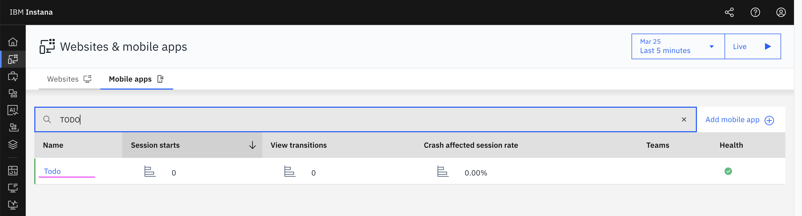

# Mobile Apps Monitoring - Flutter Based

This document explains how to monitor a mobile application in Instana. It covers creating a Mobile App Perspective in Instana, instrumenting the Flutter code, and viewing dashboards and analytics.

Refer to the official product documentation for more details : [IBM Instana – Monitoring Mobile Applications](https://www.ibm.com/docs/en/instana-observability/1.0.315?topic=instana-monitoring-mobile-applications).

## 1. Create Mobile App Perspective in Instana

Click me for more info

Let's create a Mobile App Perspective in Instana

1. Click on **Website and Mobile Apps** in the left navigation menu.

2. Click the **Mobile Apps** tab
3. Click the **Add Mobile App** button

4. Enter the **Mobile App Name**
5. Click the **Add Mobile App** button

Your app is now created. Make a note of the **Key** and **Reporting URL**.

You can now see the newly created app in the list.

## 2. Mobile App 

Click me for more info

Below are screenshots of the TODO Mobile App that we will monitor.

## 3. Instrumenting the Mobile App Code

Click me for more info

The source code of the TODO Mobile app is available [here](./src-todo-app)  

#### Dependencies

 1. Add the **Instana Agent** to the project dependencies.

#### InstanaConfig

2. Configure the **Key**, **Reporting URL** and **Meta data** in the InstanaConfig.

#### InstanaAgent.setup

3. In the main method, call the instana setup API using the **Key**, **Reporting URL** from Configuration.

#### InstanaService

4. Create a InstanaService class with the functions to interact with the Instana Agent..

#### TrackView

5. Implement **Track View** for all the screens.

#### Track User Action

6. Implement **Track User Action** for operations like add, update, and delete.

## 4. View App Dashboard in Instana

Click me for more info

Below are various sections of the **Mobile App Dashboard** in Instana:

## 5. View App Analytics in Instana

Click me for more info

Instana provides detailed **Mobile App Analytics** views:

## 6. View App Analytics Events

Click me for more info

You can explore **Mobile App Analytics Events** in Instana:

