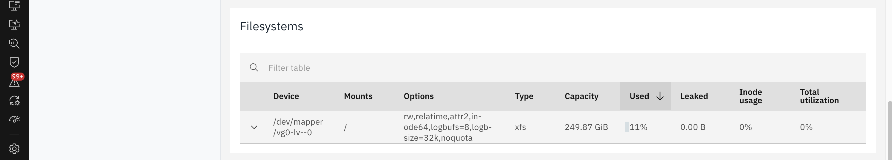
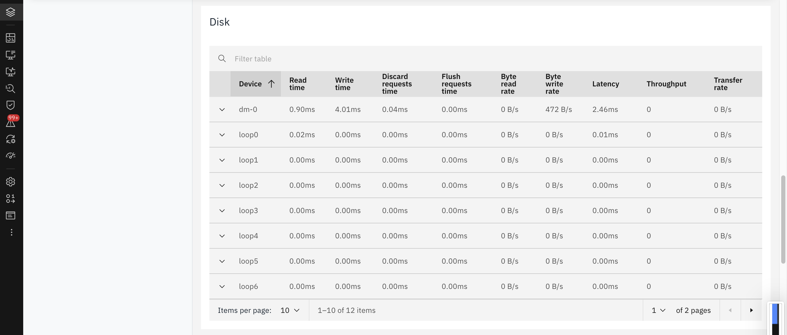

# Mobile Apps Backend Services Monitoring

This document explains how to monitor a mobile application Backend API services in Instana.

Refer to the official product documentation for more details : [IBM Instana – Monitoring Mobile Applications](https://www.ibm.com/docs/en/instana-observability/1.0.315?topic=instana-monitoring-mobile-applications).

## PreRequisite

1. Linux System with mininal configurations. OS could be Ubuntu.
2. Docker install in the Linux.
3. Access to the Instanana 

## 1. Install Instana Agent

1. Install the Instana agent using the steps given here  [Installing Instana Agent in Linux](../51-installing-instana-agent-in-linux).

## 2. Run the Backend API Application

Click me for more info

## 3. View Service Dashboard in Instana

Click me for more info

## 4. View End Point Details

Click me for more info

## 5. View Stack Details

Click me for more info

## 6. View Host Details

Click me for more info

## 7. View Docker Container Details

Click me for more info

## 8. View Docker Container Details

Click me for more info

## 9. View Python App Details

Click me for more info

## 10. View Tracing Details from Services

Click me for more info

## 11. View Tracing Details from EndPoint

Click me for more info

