# Installing Instana Server on an Ubuntu VM

This document describes how to install the **Instana Server** on an **Ubuntu virtual machine**.

In this guide, we focus on installing the **Standard Edition** in a **single-node cluster**.

The installation consists of the following steps:
- **Preparation** (file system partitioning and mounting)
- **Adding the Instana repository and installing the stanctl tool**
- **Deploying Instana**

Links to the official IBM documentation are provided in the **References** section.

### Prerequisites

- Ubuntu 22.04 LTS and above with 16 vCPUs, 64 GB RAM and 1.5 TB Disk

## Step 1 : Preparation

<details><summary>Click here for more information</summary>

### 1.1 Prepare the Additional Disks

#### 1.1.1 Identify the disks on your host

1. Run the following command to list block devices, including disks and partitions:

```bash
lsblk
```

You should see output similar to the following, where the **vda** disk contains the **vda1** and **vda2**partitions.

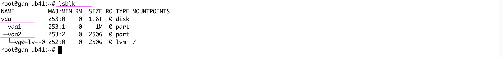


#### 1.1.2 Create partitions

1. Run the below command to open the **fdisk** utility to create partitions for the `vda` disk.

```bash
fdisk /dev/vda
```

2. Enter **p** in the command to view the existing partitions.

    You will see the **vd1** and **vd2** partitions.

3. Enter **n** in the command to create partition.

4. Press **Enter** to accept default values for Partition number, First Section and Last Sector.

    A new partition **(vda3)** is created.

5. Enter **w** command to save partitions and exit.

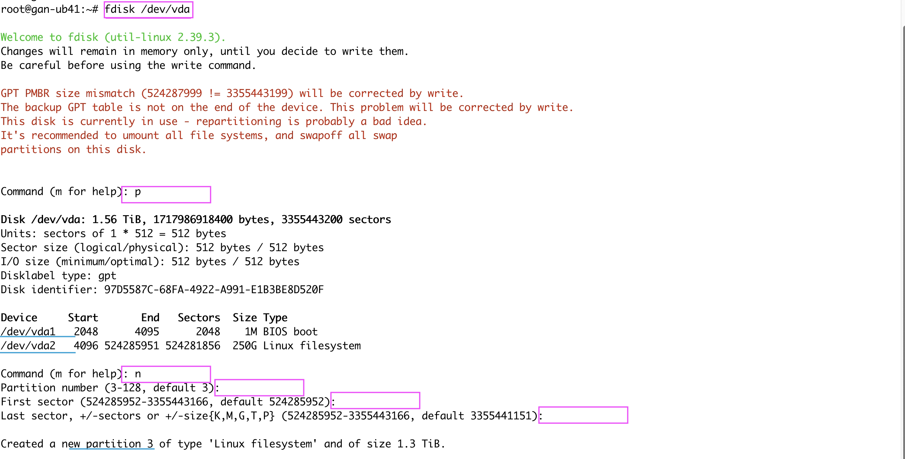
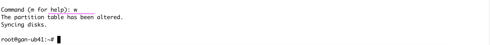

6. Run the following command again to verify the new partition:

```bash
lsblk
```
You should now see the newly created **vda3** partition.

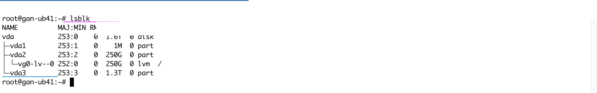

### 1.2 Create a File System

#### 1.2.1 Create the file system

1. Run the following command to install **xfsprogs** package, which provides tools for managing XFS file systems:

```bash
apt install xfsprogs
```

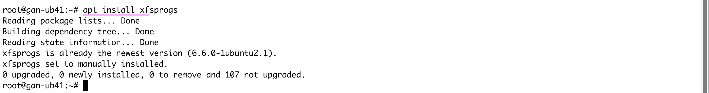


2. Run the below command to Create an XFS file system on the **vda3** partition:

```bash
mkfs.xfs -f /dev/vda3
```

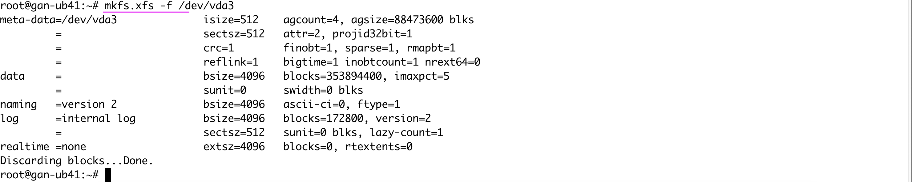

#### 1.2.2 Mount the file system.

1. Run the below command to create a mount directory :

```bash
mkdir /mnt
```

2. Run the below command to mount the **vda3** partition:

```bash
mount /dev/vda3 /mnt
```


#### 1.2.3 Persist the file system mount

To save new file system, an entry needs to be added to the **/etc/fstab** file. The format for an fstab entry is as follows:  

To make the mount persistent across reboots, need to add an entry to the **/etc/fstab** file.

<device> <dir> <type> <options> <dump> <fsck>

1. Open the file **/etc/fstab** using **vi** and add the following entry:
```
/dev/vda3                   /mnt  xfs     defaults         0       0
```


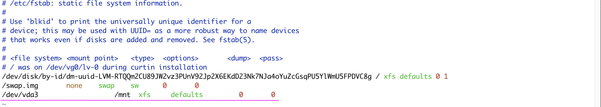

#### 1.2.4 Create directories

1. Run the below command to create the required directories for Instana.

```bash
mkdir -p /mnt/instana/stanctl/data
mkdir -p /mnt/instana/stanctl/metrics
mkdir -p /mnt/instana/stanctl/analytics
mkdir -p /mnt/instana/stanctl/objects
```
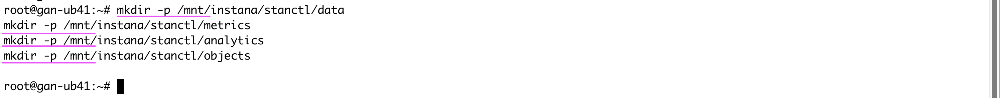

2. Run the below command to Mount all file systems defined in **/etc/fstab**:

```bash
 mount -a
```
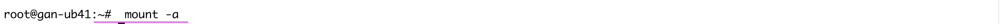

### 1.3 Kernel Parameters

Lets configure the required kernel parameters on the node.

#### 1.3.1 vm.swappiness

1. Run the following command.

```bash
 sh -c 'echo vm.swappiness=0 >> /etc/sysctl.d/99-stanctl.conf' && sysctl -p /etc/sysctl.d/99-stanctl.conf
 ```

#### 1.3.2 fs.inotify.max_user_instances

1. Run the following command.

```bash
sh -c 'echo fs.inotify.max_user_instances=8192 >> /etc/sysctl.d/99-stanctl.conf' && sysctl -p /etc/sysctl.d/99-stanctl.conf
```

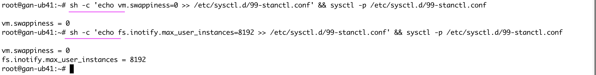


### 1.4 Transparent Huge Pages

1. Run the below command to disable the Transparent Huge Pages (THP) permanently for memory management.

```bash
sed -i "s/\(GRUB_CMDLINE_LINUX=\".*\)\"/\1 transparent_hugepage=never\"/" "/etc/default/grub"
update-grub
```

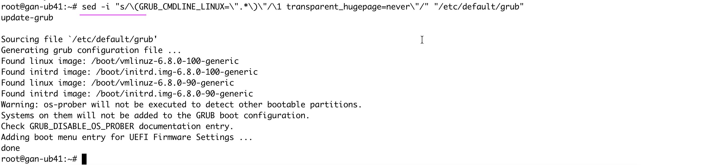

2. Reboot the VM for the changes to take effect.

3. Run the below command to verify that THP is disabled.

```bash
cat /sys/kernel/mm/transparent_hugepage/enabled
```

It should show the below output.

```
always madvise [never]
```

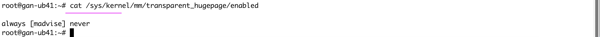


</details>

## Step 2: Add the Instana Repository and installing the stanctl tool.

<details><summary>Click here for more information</summary>


### 2.1 Add the Instana repository

1. Run the following commands to add the repository:

```bash
export DOWNLOAD_KEY=<download_key>

echo 'deb [signed-by=/usr/share/keyrings/instana-archive-keyring.gpg] https://artifact-public.instana.io/artifactory/rel-debian-public-virtual generic main' > /etc/apt/sources.list.d/instana-product.list

cat << EOF > /etc/apt/auth.conf
machine artifact-public.instana.io
  login _
  password $DOWNLOAD_KEY
EOF
wget -nv -O- --user=_ --password="$DOWNLOAD_KEY" https://artifact-public.instana.io/artifactory/api/security/keypair/public/repositories/rel-debian-public-virtual | gpg --dearmor > /usr/share/keyrings/instana-archive-keyring.gpg
```

### 2.2 Install the stanctl command-line tool

1. Run the below command to update the package index files on your host.

```bash
apt update -y
```

2. Run the below command to Install stanctl.

```bash
apt install -y stanctl
```

3. Run the below command to avoid automatic updates, set the stanctl package version.

```bash
apt-mark hold stanctl
```

4. Run the below command to verify the installation.
```bash
stanctl --version
```

</details>

## Step 3: Deploy Instana

<details><summary>Click here for more information</summary>

1. Get the **sales-key** and **download-key** for the instana server. Refer the IBM documentation [here](https://www.ibm.com/docs/en/instana-observability?topic=edition-license-activation-renewal). You will also get the **tenant name** and **unit name**.

2. Idenifty the base domain of the VM.

3. Run the below command to Deploy the instana server.

```bash
    stanctl up \
        --unit-tenant-name xxxx \
        --unit-unit-name xxxx \
        --sales-key xxxxx \
        --download-key xxxxx \
        --install-type demo \
        --unit-initial-admin-password xxxxx \
        --core-base-domain abc.xyz.com
```

The deployment typically completes within 10 minutes.

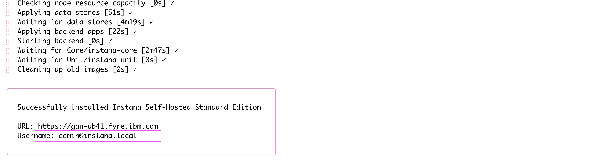

4. Note the generated URL and username.

5. Open the URL in a browser to access the Instana UI.

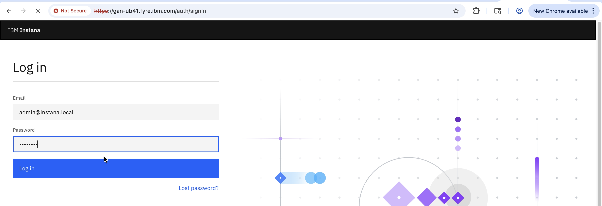

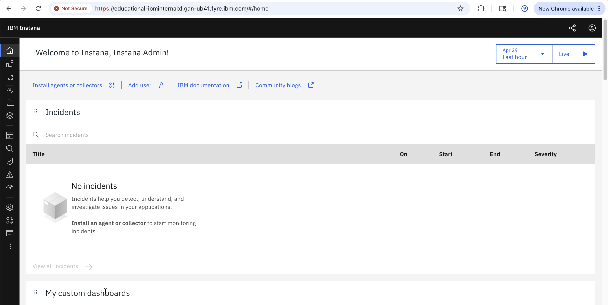

</details>


## Reference

- Step 1:  [Preparing for a single-node deployment](https://www.ibm.com/docs/en/instana-observability?topic=cluster-preparing).

- Step 2:  [Adding Instana repository and installing stanctl tool](https://www.ibm.com/docs/en/instana-observability?topic=installing-adding-instana-repository-stanctl-tool).

- Step 3:  [Installing Standard Edition in an online environment](https://www.ibm.com/docs/en/instana-observability?topic=installing-standard-edition-in-online-environment).

- [Adding a New Disk Drive to an Ubuntu 22.04 System](https://www.answertopia.com/ubuntu/adding-a-new-disk-drive-to-an-ubuntu-system/#google_vignette)


