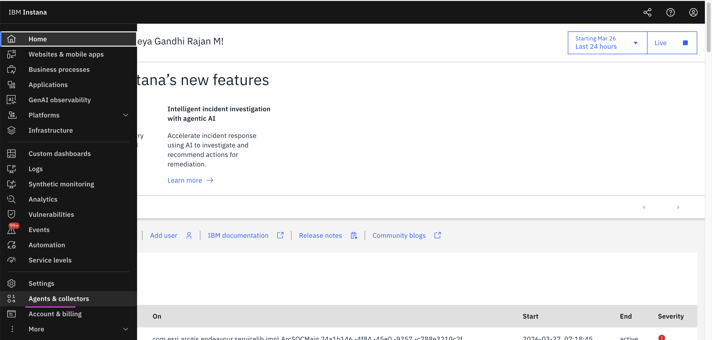
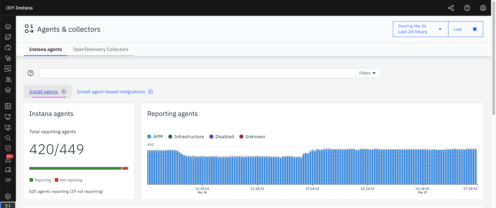
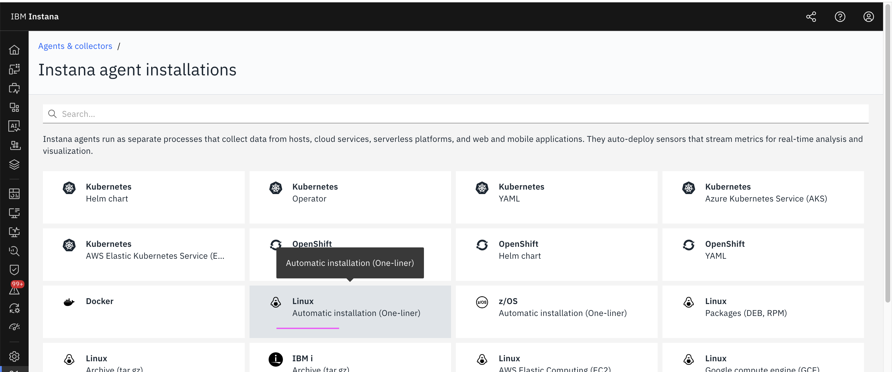
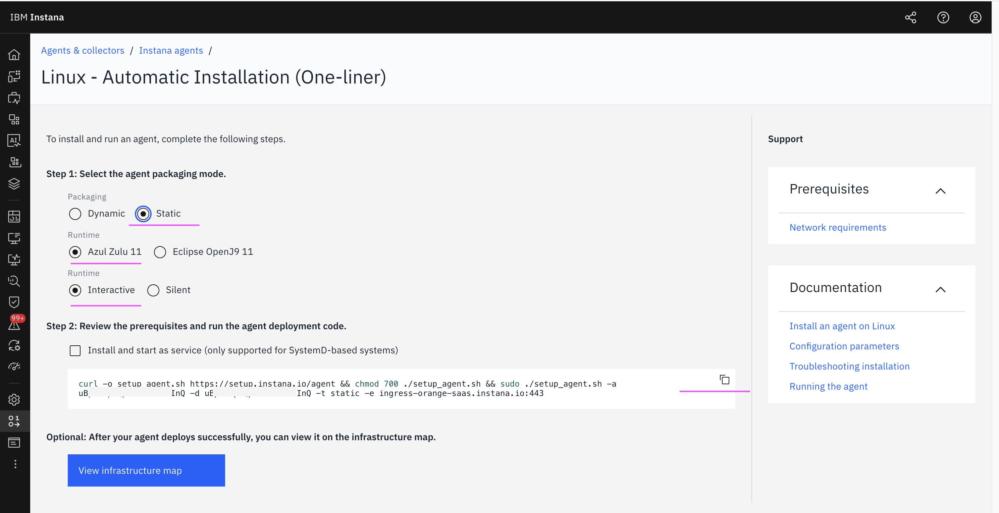
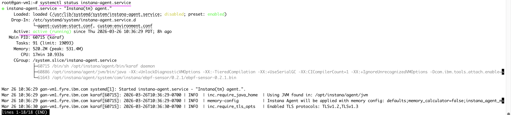
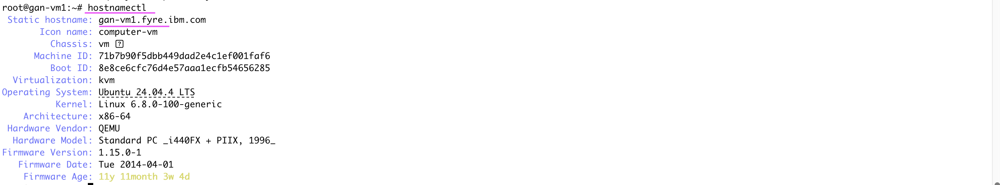
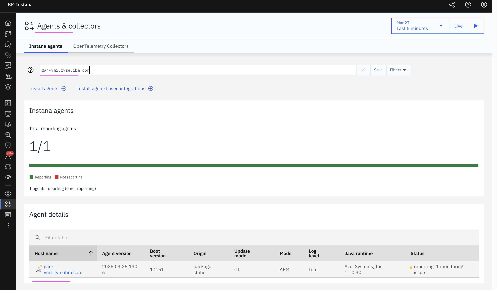

# Installing Instana Agent in Linux

This document explains how to Install Instana Agent in Linux.

Refer to the official product documentation for more details : [IBM Instana – Installing the agent on Linux](https://www.ibm.com/docs/en/instana-observability/1.0.315?topic=linux-installing-agent).

## PreRequisite

1. Linux System with mininal configurations. OS could be Ubuntu.
2. Access to the Instanana Instance

## 1. Installing Instana Agent

<details><summary>Click me for more info</summary>

1. Click the **Agents & collectors** menu in the left navigation of Instana console.


2. Click the **Install agents+** menu.


3. Click the **Linux - Automatic installation (One-liner)+** title.


4. Choose the options as seen in the below screen.

5. Copy the command displayed as `curl -o setup_agent.sh  https://setup.instana.io/agent &&....** .


6. Run the copied command in the Linux VM.
```
curl -o setup_agent.sh https://setup.instana.io/agent && chmod 700 ./setup_agent.sh && sudo ./setup_agent.sh -a xxxxxxxxx -d xxxxxxxxx -t static -e ingress-orange-saas.instana.io:443
```
<details>

## 2. Start the Instana Agent

<details><summary>Click me for more info</summary>


Refer to the official product documentation for more details : [IBM Instana – Administering the host agent on Linux](https://www.ibm.com/docs/en/instana-observability/1.0.315?topic=linux-administering-agent).

1. Start the agent using the below command.
```
systemctl start instana-agent.service
```

2. Verify the status using the below command. 

```
systemctl status instana-agent.service
```

It should show the **active** status as below.



<details>

## 3. Get Host Details

<details><summary>Click me for more info</summary>


1. Run the below command to know the details of the Host where agent is running.

```
hostnamectl
```
You may see the details as below.

Note the `Host Name`.



<details>

## 4. View the Instana Agent in Instana

<details><summary>Click me for more info</summary>


Search for the above noted `Host Name`.




<details>


## 5. Stop the Instana Agent

1. Stop the agent using the below command, if required.
```
systemctl stop instana-agent.service
```

