# Installing Instana Agent on Windows

This guide provides step-by-step instructions to install the Instana Agent on a Windows machine.

For additional details, refer to the official documentation: [IBM Instana – Installing the host agent on Windows](https://www.ibm.com/docs/en/instana-observability?topic=windows-installing-agent).

## PreRequisite

1. A Windows VM with minimum required specifications
2. Access to the Instana backend server

## 1. Download the Instana Agent Installer

<details><summary>Click me for more info</summary>

1. Log in to the Instana Server UI.

2. Click the **Agents & collectors** menu in the left navigation panel.
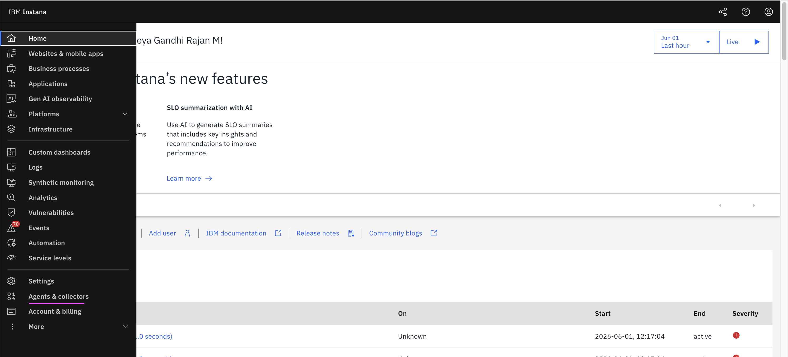

3. Click the **Install agents+** menu.
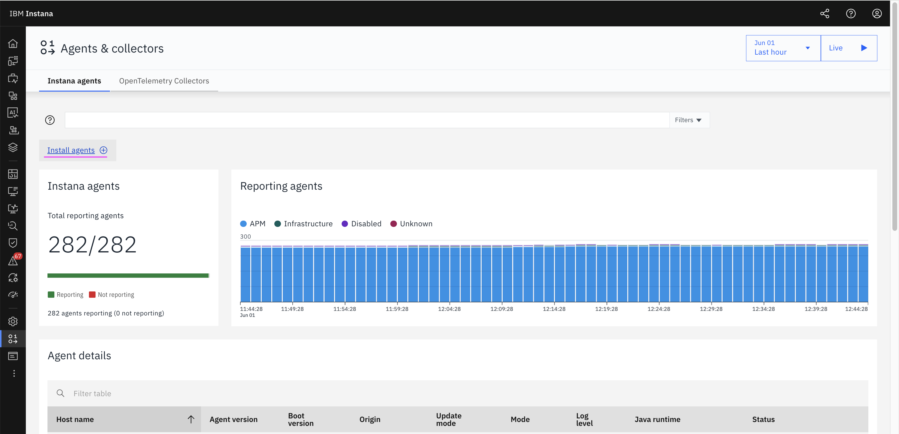

4. Click the **Windows installer 64 Bit** title.
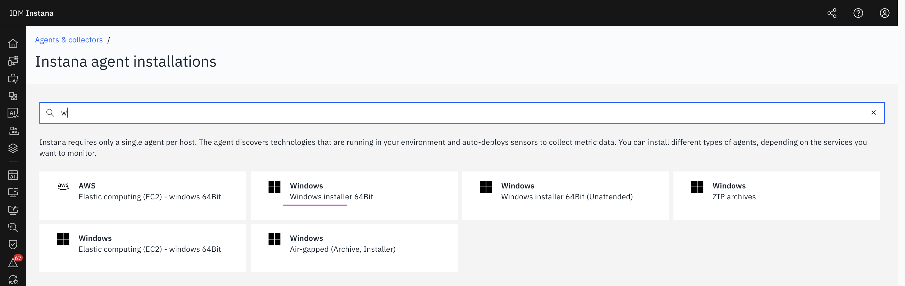

5. Configure the following options:

- **Packaging** : Static
- **Runtime** : JDK runtime based on your requirement

6. Click on **Download** arrow button to download the installer.

7. Note the highlighted details such as the Instana backend address, port, and keys.

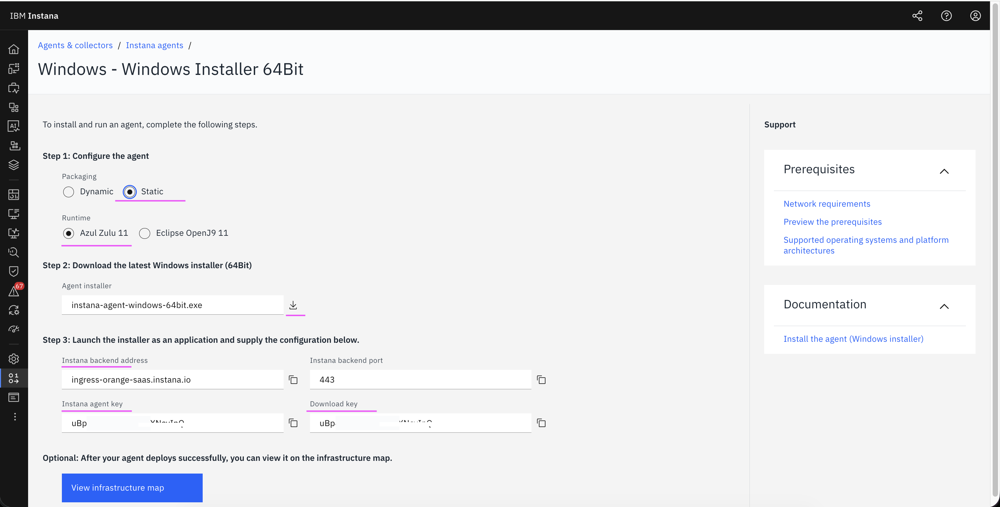

</details>

## 2. Install the Instana Agent

<details><summary>Click me for more info</summary>

### 2.1 Install the Instana Agent on a Windows VM

1. Run the downloaded **instana-agent-windows-64bit-offline.exe** on the Windows VM where you want to install the Instana Agent.

2. During the installation process, provide the required keys noted earlier in the setup wizard.

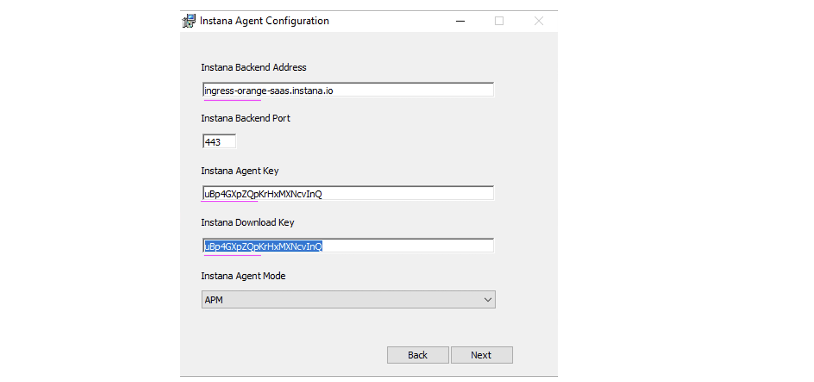

3. After the installation is complete, start the Instana Agent service.


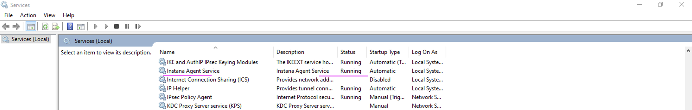


### 2.2 Retrieve Host Details

1. To identify the host where the agent is running, execute the following command.

```
hostname
```
2. Note the output. 

Ex: **gan-win11**

</details>

## 3. View the Instana Agent in the Instana Server

<details><summary>Click me for more info</summary>


1. Search for the previously noted **Host Name** in the Instana server to locate the installed agent.

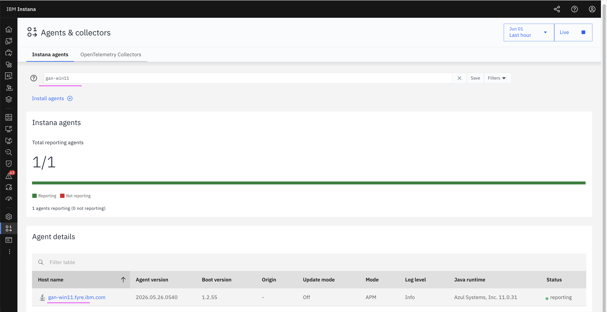

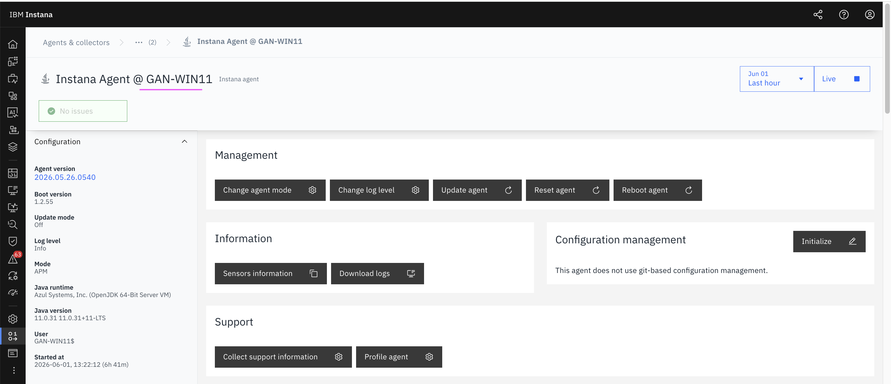
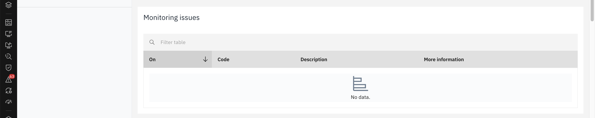
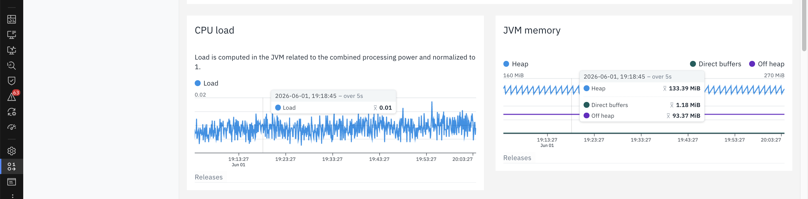
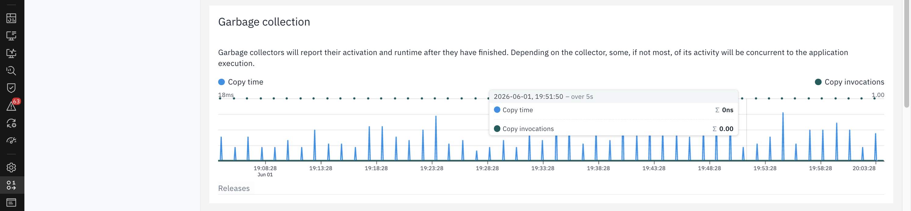
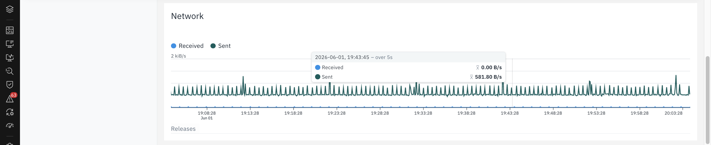
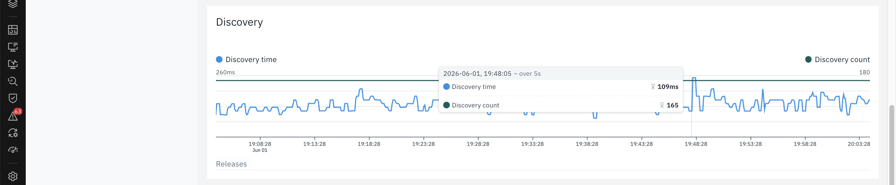
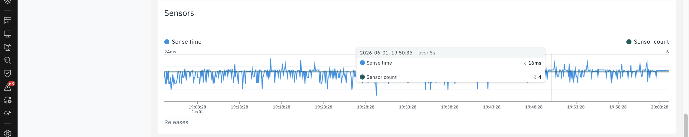
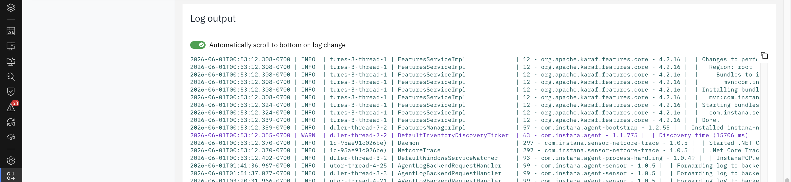
</details>

